## Provisioning OCI Compute for GraalVM Using Ansible

#### Setup a Python Virtual Environment

Python virtual environments are used to create an isolated environment for Python projects. With virtual environments, each project can have its own dependencies, regardless of the dependencies of other projects.  Essentially, virtual environments provide dependency management and project isolation. 

Since the tools we'll be using are dependent on Python, virtual environments are a logical choice for our use case.

Let's get started!

First, we'll install Python virtual environments (assumes you already have Python installed):

```
$ pip install virtualenv
```
Create a virtual environment called `oci_dev`:

```
$ virtualenv oci_dev
```
In order to use this environment’s packages/resources in isolation, you need to “activate” the environment:

```
$ source oci_dev/bin/activate
(oci_dev) ~ $
```
Notice how your prompt is now prefixed with the name of your virtual environment (`oci_dev` in our case). This is the indicator that env is currently active, which means the Python executable will only use this environment’s packages and settings.

The Python OpenSSL package is a requirement so verify the Python OpenSSL version is current (must be > 1.02):

```
(oci_dev) ~ $ python -c "import ssl; print(ssl.OPENSSL_VERSION)"
```

If you need to upgrade, execute:

```
(oci_dev) ~ $ pip install requests[security]==2.18.4
```

OK, we have the Python dependencies in place, now we'll move on to the OCI CLI installation.

#### Install the OCI CLI

As a prerequisite, you should have an active Oracle Cloud Infrastructure account.  You can setup a free account [here](https://www.oracle.com/cloud/free/).

A script automatically installs the CLI and its dependencies, simply run the following command:

```
(oci_dev) ~ $ bash -c "$(curl -L https://raw.githubusercontent.com/oracle/oci-cli/master/scripts/install/install.sh)"

 % Total    % Received % Xferd  Average Speed   Time    Time     Time  Currently
                                 Dload  Upload   Total   Spent    Left  Speed
100 17280  100 17280    0     0  50823      0 --:--:-- --:--:-- --:--:-- 50823

    ******************************************************************************
    You have started the OCI CLI Installer in interactive mode. If you do not wish
    to run this in interactive mode, please include the --accept-all-defaults option.
    If you have the script locally and would like to know more about
    input options for this script, then you can run:
    ./install.sh -h
    If you would like to know more about input options for this script, refer to:
    https://github.com/oracle/oci-cli/blob/master/scripts/install/README.rst
    ******************************************************************************
Downloading Oracle Cloud Infrastructure CLI install script from https://raw.githubusercontent.com/oracle/oci-cli/v2.22.0/scripts/install/install.py to /tmp/oci_cli_install_tmp_8OVg.
################################################################################################################# 100.0%
Running install script.
python3 /tmp/oci_cli_install_tmp_8OVg
-- Verifying Python version.
-- Python version 3.9.6 okay.

===> In what directory would you like to place the install? (leave blank to use '/home/user/lib/oracle-cli'): <Enter>
-- Creating directory '/home/user/lib/oracle-cli'.
-- We will install at '/home/user/lib/oracle-cli'.

===> In what directory would you like to place the 'oci' executable? (leave blank to use '/home/user/bin'): <Enter>
-- Creating directory '/home/user/bin'.
-- The executable will be in '/home/user/bin'.

===> In what directory would you like to place the OCI scripts? (leave blank to use '/home/user/bin/oci-cli-scripts'): <Enter>
-- Creating directory '/home/user/bin/oci-cli-scripts'.
-- The scripts will be in '/home/user/bin/oci-cli-scripts'.

===> Currently supported optional packages are: ['db (will install cx_Oracle)']
What optional CLI packages would you like to be installed (comma separated names; press enter if you don't need any optional packages)?: <Enter>
-- The optional packages installed will be ''.
-- Trying to use python3 venv.
-- Executing: ['/home/user/oci_dev/bin/python3', '-m', 'venv', '/home/user/lib/oracle-cli']
-- Executing: ['/home/user/lib/oracle-cli/bin/pip', 'install', '--upgrade', 'pip']
Requirement already satisfied: pip in ./lib/oracle-cli/lib/python3.9/site-packages (21.0.1)
Collecting pip
  Using cached pip-21.2.4-py3-none-any.whl (1.6 MB)
Installing collected packages: pip
  Attempting uninstall: pip
    Found existing installation: pip 21.0.1
    Uninstalling pip-21.0.1:
      Successfully uninstalled pip-21.0.1
Successfully installed pip-21.2.4
-- Executing: ['/home/user/lib/oracle-cli/bin/pip', 'install', '--cache-dir', '/tmp/tmppqkdohig', 'wheel', '--upgrade']
Collecting wheel
  Downloading wheel-0.37.0-py2.py3-none-any.whl (35 kB)
Installing collected packages: wheel
Successfully installed wheel-0.37.0
-- Executing: ['/home/user/lib/oracle-cli/bin/pip', 'install', '--cache-dir', '/tmp/tmppqkdohig', 'oci_cli', '--upgrade']
Collecting oci_cli
  Downloading oci_cli-3.0.2-py3-none-any.whl (20.5 MB)
     |████████████████████████████████| 20.5 MB 1.5 MB/s
Collecting oci==2.44.1
  Downloading oci-2.44.1-py2.py3-none-any.whl (10.2 MB)
     |████████████████████████████████| 10.2 MB 4.8 MB/s
Collecting jmespath==0.10.0
  Downloading jmespath-0.10.0-py2.py3-none-any.whl (24 kB)
Collecting pyOpenSSL==19.1.0
  Downloading pyOpenSSL-19.1.0-py2.py3-none-any.whl (53 kB)
     |████████████████████████████████| 53 kB 3.9 MB/s
Collecting arrow==0.17.0
  Downloading arrow-0.17.0-py2.py3-none-any.whl (50 kB)
     |████████████████████████████████| 50 kB 8.9 MB/s
Collecting terminaltables==3.1.0
  Downloading terminaltables-3.1.0.tar.gz (12 kB)
Collecting certifi
  Downloading certifi-2021.5.30-py2.py3-none-any.whl (145 kB)
     |████████████████████████████████| 145 kB 38.0 MB/s
Collecting cryptography<=3.4.7,>3.2.1
  Downloading cryptography-3.4.7-cp36-abi3-manylinux2014_x86_64.whl (3.2 MB)
     |████████████████████████████████| 3.2 MB 28.8 MB/s
Collecting python-dateutil<3.0.0,>=2.5.3
  Downloading python_dateutil-2.8.2-py2.py3-none-any.whl (247 kB)
     |████████████████████████████████| 247 kB 3.7 MB/s
Collecting click==7.1.2
  Downloading click-7.1.2-py2.py3-none-any.whl (82 kB)
     |████████████████████████████████| 82 kB 2.3 MB/s
Collecting pytz>=2016.10
  Downloading pytz-2021.1-py2.py3-none-any.whl (510 kB)
     |████████████████████████████████| 510 kB 29.4 MB/s
Collecting six>=1.15.0
  Downloading six-1.16.0-py2.py3-none-any.whl (11 kB)
Collecting configparser==4.0.2
  Downloading configparser-4.0.2-py2.py3-none-any.whl (22 kB)
Collecting PyYAML<6,>=5.4
  Downloading PyYAML-5.4.1-cp39-cp39-manylinux1_x86_64.whl (630 kB)
     |████████████████████████████████| 630 kB 18.0 MB/s
Collecting cffi>=1.12
  Downloading cffi-1.14.6-cp39-cp39-manylinux1_x86_64.whl (405 kB)
     |████████████████████████████████| 405 kB 13.8 MB/s
Collecting pycparser
  Downloading pycparser-2.20-py2.py3-none-any.whl (112 kB)
     |████████████████████████████████| 112 kB 5.4 MB/s
Building wheels for collected packages: terminaltables
  Building wheel for terminaltables (setup.py) ... done
  Created wheel for terminaltables: filename=terminaltables-3.1.0-py3-none-any.whl size=15354 sha256=40ac38a4354cf28fdc6883174f139daea3d2f7f5086b1185b090684e1a250d1e
  Stored in directory: /tmp/tmppqkdohig/wheels/d6/42/1c/ac35bb80b4d95dd2bbf7aa111392fe7eb4095952c66cc4d619
Successfully built terminaltables
Installing collected packages: pycparser, cffi, six, cryptography, pytz, python-dateutil, pyOpenSSL, configparser, certifi, terminaltables, PyYAML, oci, jmespath, click, arrow, oci-cli
Successfully installed PyYAML-5.4.1 arrow-0.17.0 certifi-2021.5.30 cffi-1.14.6 click-7.1.2 configparser-4.0.2 cryptography-3.4.7 jmespath-0.10.0 oci-2.44.1 oci-cli-3.0.2 pyOpenSSL-19.1.0 pycparser-2.20 python-dateutil-2.8.2 pytz-2021.1 six-1.16.0 terminaltables-3.1.0

===> Modify profile to update your $PATH and enable shell/tab completion now? (Y/n): Y

===> Enter a path to an rc file to update (file will be created if it does not exist) (leave blank to use '/home/user/.bashrc'): <Enter>
-- Backed up '/home/user/.bashrc' to '/home/user/.bashrc.backup'
-- Tab completion set up complete.
-- If tab completion is not activated, verify that '/home/user/.bashrc' is sourced by your shell.
--
-- ** Run `exec -l $SHELL` to restart your shell. **
--
-- Installation successful.
-- Run the CLI with /home/user/bin/oci --help
```
As an alternative, if you're using Oracle Linux 8, you can use `dnf` to install the CLI:

```
(oci_dev) ~ $ sudo dnf -y install oraclelinux-developer-release-el8
(oci_dev) ~ $ sudo dnf install python36-oci-cli
```
For other platforms, see the docs [here](https://docs.oracle.com/en-us/iaas/Content/API/SDKDocs/cliinstall.htm).

Verify the CLI installed properly:
```
(oci_dev) ~ $ oci --version
3.0.2
```


#### Generate Key Pair

You'll need to generate a RSA key pair and provide a fingerprint of the public key. The public key must also be uploaded to your OCI Console.  

**NOTE:** This key pair is not the SSH key that you use to access compute instances. 

First, let's create a directory to store the keys:
```
(oci_dev) ~ $ mkdir ~/.oci
```

Install `openssl` (if not already installed):

```
(oci_dev) ~ $ sudo dnf install openssl
[sudo] password for user:
Fedora 34 - x86_64 - Updates                                                             23 kB/s |  10 kB     00:00
Fedora 34 - x86_64 - Updates                                                            2.1 MB/s | 2.7 MB     00:01
Fedora Modular 34 - x86_64 - Updates                                                     40 kB/s |  12 kB     00:00
Dependencies resolved.
========================================================================================================================
 Package                   Architecture             Version                              Repository                Size
========================================================================================================================
Installing:
 openssl                   x86_64                   1:1.1.1k-1.fc34                      fedora                   667 k

Transaction Summary
========================================================================================================================
Install  1 Package

Total download size: 667 k
Installed size: 1.1 M
Is this ok [y/N]: y
Downloading Packages:
openssl-1.1.1k-1.fc34.x86_64.rpm                                                        462 kB/s | 667 kB     00:01
------------------------------------------------------------------------------------------------------------------------
Total                                                                                   408 kB/s | 667 kB     00:01
Running transaction check
Transaction check succeeded.
Running transaction test
Transaction test succeeded.
Running transaction
  Preparing        :                                                                                                1/1
  Installing       : openssl-1:1.1.1k-1.fc34.x86_64                                                                 1/1
  Running scriptlet: openssl-1:1.1.1k-1.fc34.x86_64                                                                 1/1
  Verifying        : openssl-1:1.1.1k-1.fc34.x86_64                                                                 1/1

Installed:
  openssl-1:1.1.1k-1.fc34.x86_64

Complete!
```

Generate Private Key pem:

```
(oci_dev) ~ $ openssl genrsa -out ~/.oci/oci_api_key.pem 2048
Generating RSA private key, 2048 bit long modulus (2 primes)
.......................................+++++
........................................+++++
e is 65537 (0x010001)
```
Change the file permissions:
```
(oci_dev) ~ $ chmod go-rwx ~/.oci/oci_api_key.pem
```

Generate Public Key pem:

```
(oci_dev) ~ $ openopenssl rsa -pubout -in ~/.oci/oci_api_key.pem -out ~/.oci/oci_api_key_public.pem
writing RSA key
```

Create Fingerprint file:

```
(oci_dev) ~ $ openopenssl rsa -in .oci/oci_api_key.pem -pubout -outform DER | openssl md5 -c | awk -F= '{gsub(" ","",$2);print $2}' > .oci/oci_api_key_fingerprint
writing RSA key
```

Copy your Public Key and paste it into your Oracle Cloud console. From the Menu, choose **Identity -> Users -> API Keys -> Add API Key**

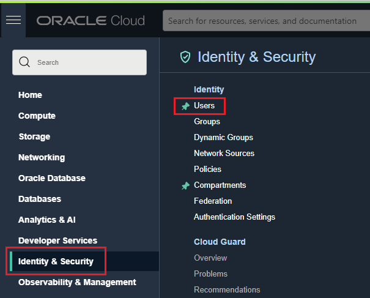

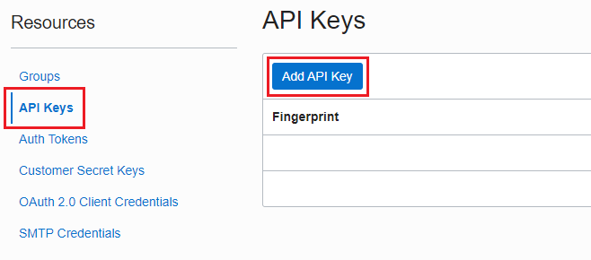

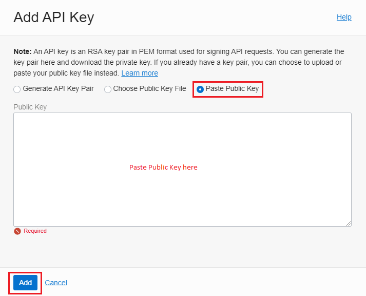


From your Oracle Cloud Account, you’ll need to capture OCIDs for:

* Your Tenancy
* Your Compartment
* Your User

Obtaining your **Tenancy** OCID:

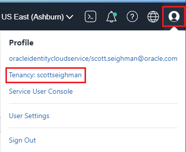

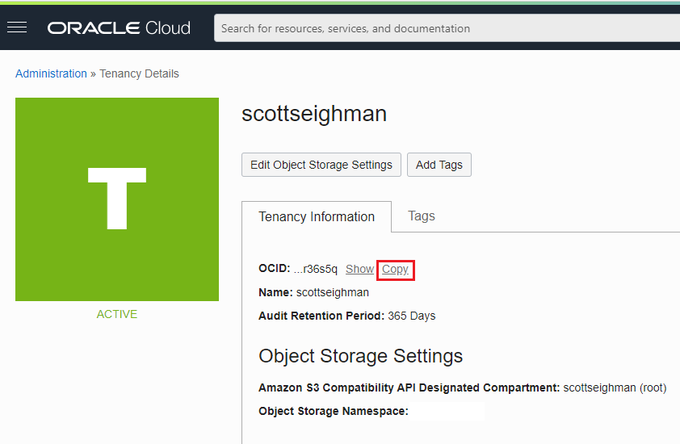

Obtaining your **Compartment** OCID:

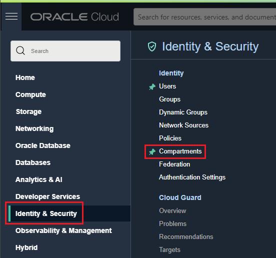

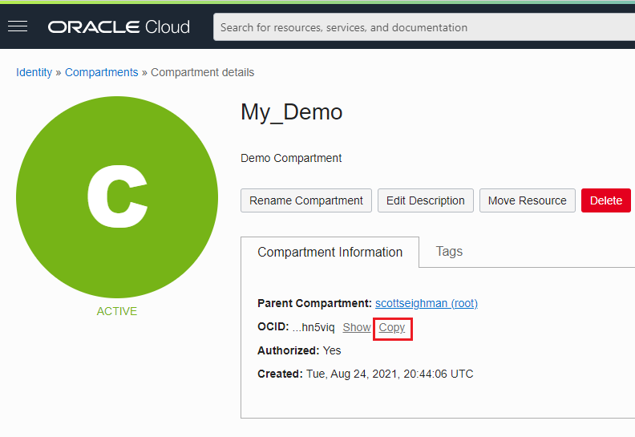

Obtaining your **User** OCID:


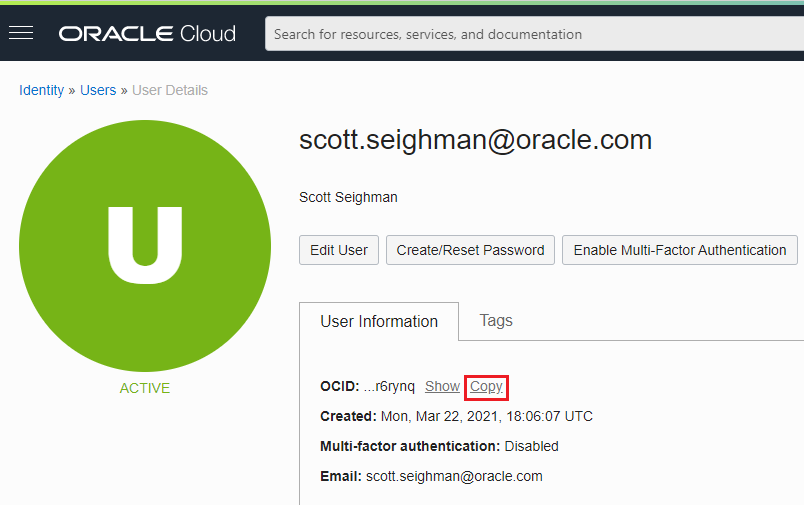


Run the OCI CLI configuration script (you'll be asked to provide the OCIDs mentioned above).

**NOTE:** Choose the region identified in your OCI console.  Also, answer `N` when prompted to **generate a new API Signing RSA key pair** and then provide the path to your `.oci` directory (created in an earlier step) containing the private key.

```
(oci_dev) ~ $ oci setup config
    This command provides a walkthrough of creating a valid CLI config file.

    The following links explain where to find the information required by this script:

    User API Signing Key, OCID and Tenancy OCID:
        https://docs.cloud.oracle.com/Content/API/Concepts/apisigningkey.htm#Other

    Region:

        https://docs.cloud.oracle.com/Content/General/Concepts/regions.htm

    General config documentation:

        https://docs.cloud.oracle.com/Content/API/Concepts/sdkconfig.htm

Enter a location for your config [/home/user/.oci/config]: <Enter>
Enter a user OCID: ocid1.user.oc1..aaaaaaaaxxxxx
Enter a tenancy OCID: ocid1.tenancy.oc1..aaaaaaaaxxxx
Enter a region by index or name(e.g.
1: ap-chiyoda-1, 2: ap-chuncheon-1, 3: ap-hyderabad-1, 4: ap-melbourne-1, 5: ap-mumbai-1,6: ap-osaka-1, 7: ap-seoul-1, 8: ap-sydney-1, 9: ap-tokyo-1, 10: ca-montreal-1,11: ca-toronto-1, 12: eu-amsterdam-1, 13: eu-frankfurt-1, 14: eu-zurich-1, 15: me-dubai-1,16: me-jeddah-1, 17: sa-santiago-1, 18: sa-saopaulo-1, 19: sa-vinhedo-1, 20: uk-cardiff-1,21: uk-gov-cardiff-1, 22: uk-gov-london-1, 23: uk-london-1, 24: us-ashburn-1, 25: us-gov-ashburn-1,
26: us-gov-chicago-1, 27: us-gov-phoenix-1, 28: us-langley-1, 29: us-luke-1, 30: us-phoenix-1,31: us-sanjose-1): 24
Do you want to generate a new API Signing RSA key pair? (If you decline you will be asked to supply the path to an existing key.) [Y/n]: n
Enter the location of your API Signing private key file: ~user/.oci/oci_api_key.pem
Fingerprint: f2:52:17:90:ea
Config written to /home/user/.oci/config

    If you haven't already uploaded your API Signing public key through the
    console, follow the instructions on the page linked below in the section
    'How to upload the public key':

        https://docs.cloud.oracle.com/Content/API/Concepts/apisigningkey.htm#How2
```

If you're curious about the contents of the config file:
```
(oci_dev) ~ $ cat .oci/config
[DEFAULT]
user=ocid1.user.oc1..aaaaaaaaxxx
fingerprint=f2:52:17:90:ea
key_file=/home/user/.oci/oci_api_key.pem
tenancy=ocid1.tenancy.oc1..aaaaaaaaxxxx
region=us-ashburn-1
```


Test your `oci-cli` environment is configured correctly by executing an API request. First, supress warning messages:

```
(oci_dev) ~ $ export OCI_CLI_SUPPRESS_FILE_PERMISSIONS_WARNING=True
```

Execute the test to verify connectivity:

```
$ oci iam availability-domain list
{
  "data": [
    {
      "compartment-id": "ocid1.tenancy.oc1..aaaaaaaahatekguf6mysfjwngurspd54ocgietrttwoc24obe3kqw4r36s5q",
      "id": "ocid1.availabilitydomain.oc1..aaaaaaaaztunlny6ae4yw2vghp5go2zceaonwp6wiioe3tnh2vlaxjjl2n3a",
      "name": "AXeg:US-ASHBURN-AD-1"
    },
    {
      "compartment-id": "ocid1.tenancy.oc1..aaaaaaaahatekguf6mysfjwngurspd54ocgietrttwoc24obe3kqw4r36s5q",
      "id": "ocid1.availabilitydomain.oc1..aaaaaaaauvt2n7pijol7uqgdnnsoojcukrijtmcltvfwxazmitk235wyohta",
      "name": "AXeg:US-ASHBURN-AD-2"
    },
    {
      "compartment-id": "ocid1.tenancy.oc1..aaaaaaaahatekguf6mysfjwngurspd54ocgietrttwoc24obe3kqw4r36s5q",
      "id": "ocid1.availabilitydomain.oc1..aaaaaaaatrwxaogr7dl4yschqtrmqrdv6uzis3mgbnomiagqrfhcb7mxsfdq",
      "name": "AXeg:US-ASHBURN-AD-3"
    }
  ]
}
```
Congratulations, you have successfully installed the OCI CLI and other prerequisites necessary to provision instances on OCI.  Let's move onto the next step, automating the provisioning of a compute instance.


### Using Ansible to Provision an OCI Compute Instance

#### Install Ansible

Ansible is a tool that provides automation for cross-platform systems. It's great for application deployment, system updates, cloud provisioning, configuration management, orchestration, and nearly anything a systems administrator does on a weekly or daily basis. 

Oracle provides a number of Ansible modules to interact with Oracle Cloud Infrastructure so we'll use these modules to automate the provisioning process.

First, let's install Ansible.  I would recommend using the `pip install` approach but you can also install Ansible using a package manager:

```
(oci_dev) ~ $ sudo dnf install ansible

Or

(oci_dev) ~ $ pip install ansible       (<-recommended)

$ ansible --version
ansible 2.9.24
  config file = /etc/ansible/ansible.cfg
  configured module search path = ['/home/user/.ansible/plugins/modules', '/usr/share/ansible/plugins/modules']
  ansible python module location = /usr/lib/python3.9/site-packages/ansible
  executable location = /usr/bin/ansible
  python version = 3.9.6 (default, Jul 16 2021, 00:00:00) [GCC 11.1.1 20210531 (Red Hat 11.1.1-3)]
```

Install the Oracle Cloud Infrastructure Python SDK:

```
(oci_dev) ~ $ pip install oci
Collecting oci
  Downloading oci-2.44.1-py2.py3-none-any.whl (10.2 MB)
     |████████████████████████████████| 10.2 MB 2.6 MB/s
Collecting pyOpenSSL<=19.1.0,>=17.5.0
  Downloading pyOpenSSL-19.1.0-py2.py3-none-any.whl (53 kB)
     |████████████████████████████████| 53 kB 2.5 MB/s
Collecting python-dateutil<3.0.0,>=2.5.3
  Downloading python_dateutil-2.8.2-py2.py3-none-any.whl (247 kB)
     |████████████████████████████████| 247 kB 3.7 MB/s
Collecting pytz>=2016.10
  Downloading pytz-2021.1-py2.py3-none-any.whl (510 kB)
     |████████████████████████████████| 510 kB 3.6 MB/s
Collecting configparser==4.0.2
  Downloading configparser-4.0.2-py2.py3-none-any.whl (22 kB)
Collecting certifi
  Downloading certifi-2021.5.30-py2.py3-none-any.whl (145 kB)
     |████████████████████████████████| 145 kB 4.0 MB/s
Collecting cryptography<=3.4.7,>=3.2.1
  Downloading cryptography-3.4.7-cp36-abi3-manylinux2014_x86_64.whl (3.2 MB)
     |████████████████████████████████| 3.2 MB 4.1 MB/s
Collecting cffi>=1.12
  Downloading cffi-1.14.6-cp39-cp39-manylinux1_x86_64.whl (405 kB)
     |████████████████████████████████| 405 kB 4.4 MB/s
Collecting pycparser
  Downloading pycparser-2.20-py2.py3-none-any.whl (112 kB)
     |████████████████████████████████| 112 kB 4.9 MB/s
Collecting six>=1.5.2
  Using cached six-1.16.0-py2.py3-none-any.whl (11 kB)
Installing collected packages: pycparser, cffi, six, cryptography, pytz, python-dateutil, pyOpenSSL, configparser, certifi, oci
Successfully installed certifi-2021.5.30 cffi-1.14.6 configparser-4.0.2 cryptography-3.4.7 oci-2.44.1 pyOpenSSL-19.1.0 pycparser-2.20 python-dateutil-2.8.2 pytz-2021.1 six-1.16.0
```

Verfiy it installed properly:

```
(oci_dev) ~ $ pip list
Package         Version
--------------- ---------
ansible         4.4.0
ansible-core    2.11.4
certifi         2021.5.30
cffi            1.14.6
configparser    4.0.2
cryptography    3.4.7
Jinja2          3.0.1
MarkupSafe      2.0.1
oci             2.44.1  <--
packaging       21.0
pip             21.2.4
pycparser       2.20
pyOpenSSL       19.1.0
pyparsing       2.4.7
python-dateutil 2.8.2
pytz            2021.1
PyYAML          5.4.1
resolvelib      0.5.4
setuptools      57.4.0
six             1.16.0
wheel           0.37.0
```

As mentioned, Oracle provides a number of Ansible modules to interact with OCI and you can install the Ansible OCI Modules in one of two ways:

* Use Ansible Galaxy
* Clone the Repository from GitHub

Using Ansible Galaxy:

```
(oci_dev) ~ $ ansible-galaxy install oracle.oci_ansible_modules
```

Clone the OCI Ansible Collection repository:

```
(oci_dev) ~ $ git clone https://github.com/oracle/oci-ansible-collection.git

(oci_dev) ~ $ cd oci-ansible-collection/samples/compute/always_free_launch_compute_instance/
```


Next, you'll need to export environment variables containing the '**Image OCID**' and '**Compartment OCID**'.

OCIDs for Images can be found [here](https://docs.oracle.com/en-us/iaas/images/).

In our example, we’ll provision an Oracle Linux 8.4 image, the OCID for the image can be found by scrolling down the following link to the region for your OCI account:

[https://docs.oracle.com/en-us/iaas/images/image/f20551e8-ae52-4d99-9b5f-3c32c473e07f/](https://docs.oracle.com/en-us/iaas/images/image/f20551e8-ae52-4d99-9b5f-3c32c473e07f/)

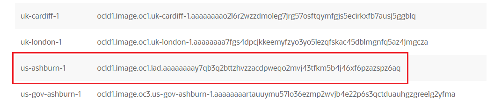

I’m in the US East Ashburn region:

```
(oci_dev) ~ $ export SAMPLE_IMAGE_OCID=ocid1.image.oc1.iad.aaaaaaaay7qb3q2bttzhvzzacdpweqo2mvj43tfkm5b4j46xf6pzazspz6aq
```
```
(oci_dev) ~ $ export SAMPLE_COMPARTMENT_OCID=ocid1.tenancy.oc1..aaaaaaaaxxxxxxx
```


Execute the Ansible playbook:

```
(oci_dev) ~ $ ansible-playbook sample.yaml

[WARNING]: No inventory was parsed, only implicit localhost is available
[WARNING]: provided hosts list is empty, only localhost is available. Note that the implicit localhost does not match
'all'

PLAY [Launch a compute instance and connect to it using SSH] ***********************************************************

TASK [Gathering Facts] *************************************************************************************************
ok: [localhost]

TASK [Check prerequisites] ********************************************************************************************
skipping: [localhost] => (item=SAMPLE_COMPARTMENT_OCID)
skipping: [localhost] => (item=SAMPLE_IMAGE_OCID)

TASK [List availability domains] ****************************************************************************************
ok: [localhost]

TASK [set_fact] ********************************************************************************************************
ok: [localhost]

TASK [debug] ***********************************************************************************************************
ok: [localhost] => {
    "msg": [
        {
            "compartment_id": "ocid1.compartment.oc1..aaaaaaaaj2smhxp5gpg74tpyt6i5cz3zohbnelk7qbfjmq7exynkpmhn5viq",
            "id": "ocid1.availabilitydomain.oc1..aaaaaaaaztunlny6ae4yw2vghp5go2zceaonwp6wiioe3tnh2vlaxjjl2n3a",
            "name": "AXeg:US-ASHBURN-AD-1"
        },
        {
            "compartment_id": "ocid1.compartment.oc1..aaaaaaaaj2smhxp5gpg74tpyt6i5cz3zohbnelk7qbfjmq7exynkpmhn5viq",
            "id": "ocid1.availabilitydomain.oc1..aaaaaaaauvt2n7pijol7uqgdnnsoojcukrijtmcltvfwxazmitk235wyohta",
            "name": "AXeg:US-ASHBURN-AD-2"
        },
        {
            "compartment_id": "ocid1.compartment.oc1..aaaaaaaaj2smhxp5gpg74tpyt6i5cz3zohbnelk7qbfjmq7exynkpmhn5viq",
            "id": "ocid1.availabilitydomain.oc1..aaaaaaaatrwxaogr7dl4yschqtrmqrdv6uzis3mgbnomiagqrfhcb7mxsfdq",
            "name": "AXeg:US-ASHBURN-AD-3"
        }
    ]
}

TASK [List shapes in first AD] *****************************************************************************************
ok: [localhost]

TASK [set_fact] ********************************************************************************************************

TASK [List shapes in second AD] ****************************************************************************************
ok: [localhost]

TASK [set_fact] ********************************************************************************************************

TASK [List shapes in third AD] *****************************************************************************************
ok: [localhost]

TASK [set_fact] ********************************************************************************************************
ok: [localhost] => (item={'baseline_ocpu_utilizations': None, 'min_total_baseline_ocpus_required': None, 'shape': 'VM.Standard.E2.1.Micro', 'processor_description': '2.0 GHz AMD EPYC™ 7551 (Naples)', 'ocpus': 1.0, 'memory_in_gbs': 1.0, 'networking_bandwidth_in_gbps': 0.48, 'max_vnic_attachments': 1, 'gpus': 0, 'gpu_description': None, 'local_disks': 0, 'local_disks_total_size_in_gbs': None, 'local_disk_description': None, 'is_live_migration_supported': True, 'ocpu_options': None, 'memory_options': None, 'networking_bandwidth_options': None, 'max_vnic_attachment_options': None})

TASK [Create a temporary directory to house a temporary SSH keypair we will later use to connect to instance] **********
changed: [localhost]

TASK [set_fact] ********************************************************************************************************
ok: [localhost]

TASK [Generate a Private Key] ******************************************************************************************
changed: [localhost]

TASK [set_fact] ********************************************************************************************************
ok: [localhost]

TASK [Generate a Public Key] *******************************************************************************************
changed: [localhost]

TASK [Create a VCN] ****************************************************************************************************
changed: [localhost]

TASK [set_fact] ********************************************************************************************************
ok: [localhost]

TASK [Create a new Internet Gateway] ***********************************************************************************
changed: [localhost]

TASK [set_fact] ********************************************************************************************************
ok: [localhost]

TASK [Create route table to connect internet gateway to the VCN] *******************************************************
changed: [localhost]

TASK [set_fact] ********************************************************************************************************
ok: [localhost]

TASK [create ingress rules yaml body] **********************************************************************************
changed: [localhost]

TASK [create egress yaml body] *****************************************************************************************
changed: [localhost]

TASK [load the variables defined in the ingress rules yaml body] *******************************************************
ok: [localhost]

TASK [print loaded_ingress] ********************************************************************************************
ok: [localhost] => {
    "msg": "loaded ingress is {'instance_ingress_security_rules': [{'source': '0.0.0.0/0', 'protocol': '6', 'tcp_options': {'destination_port_range': {'min': 22, 'max': 22}}}]}"
}

TASK [load the variables defined in the egress rules yaml body] ********************************************************
ok: [localhost]

TASK [print loaded_egress] *********************************************************************************************
ok: [localhost] => {
    "msg": "loaded egress is {'instance_egress_security_rules': [{'destination': '0.0.0.0/0', 'protocol': '6', 'tcp_options': {'destination_port_range': {'min': 22, 'max': 22}}}]}"
}

TASK [Create a security list for allowing access to public instance] ***************************************************
changed: [localhost]

TASK [set_fact] ********************************************************************************************************
ok: [localhost]

TASK [Create a subnet to host the public instance. Link security_list and route_table.] ********************************
changed: [localhost]

TASK [set_fact] ********************************************************************************************************
ok: [localhost]

TASK [Launch an instance] **********************************************************************************************
changed: [localhost]

TASK [Print instance details] ******************************************************************************************
ok: [localhost] => {
    "msg": "Launched a new instance {'changed': True, 'instance': {'availability_domain': 'AXeg:US-ASHBURN-AD-3', 'capacity_reservation_id': None, 'compartment_id': 'ocid1.compartment.oc1..aaaaaaaaxxxx', 'dedicated_vm_host_id': None, 'defined_tags': {'Oracle-Tags': {'CreatedBy': 'scott.seighman@oracle.com', 'CreatedOn': '2021-08-25T20:26:36.590Z'}}, 'display_name': 'my_always_free_test_instance', 'extended_metadata': {}, 'fault_domain': 'FAULT-DOMAIN-2', 'freeform_tags': {}, 'id': 'ocid1.instance.oc1.iad.anuwcljtxxxx', 'image_id': 'ocid1.image.oc1.iad.aaaaaaaaxxxx', 'ipxe_script': None, 'launch_mode': 'PARAVIRTUALIZED', 'launch_options': {'boot_volume_type': 'PARAVIRTUALIZED', 'firmware': 'UEFI_64', 'network_type': 'PARAVIRTUALIZED', 'remote_data_volume_type': 'PARAVIRTUALIZED', 'is_pv_encryption_in_transit_enabled': False, 'is_consistent_volume_naming_enabled': True}, 'instance_options': {'are_legacy_imds_endpoints_disabled': False}, 'availability_config': {'is_live_migration_preferred': None, 'recovery_action': 'RESTORE_INSTANCE'}, 'preemptible_instance_config': None, 'lifecycle_state': 'RUNNING', 'metadata': {'ssh_authorized_keys': 'ssh-rsa AAAAB3N'}, 'region': 'iad', 'shape': 'VM.Standard.E2.1.Micro', 'shape_config': {'ocpus': 1.0, 'memory_in_gbs': 1.0, 'baseline_ocpu_utilization': None, 'processor_description': '2.0 GHz AMD EPYC™ 7551 (Naples)', 'networking_bandwidth_in_gbps': 0.48, 'max_vnic_attachments': 1, 'gpus': 0, 'gpu_description': None, 'local_disks': 0, 'local_disks_total_size_in_gbs': None, 'local_disk_description': None}, 'source_details': {'source_type': 'image', 'boot_volume_size_in_gbs': None, 'image_id': 'ocid1.image.oc1.iad.aaaaaaaay7qb3q2bttzhvzzacdpweqo2mvj43tfkm5b4j46xf6pzazspz6aq', 'kms_key_id': None}, 'system_tags': {'orcl-cloud': {'free-tier-retained': 'true'}}, 'time_created': '2021-08-25T20:26:37.219000+00:00', 'agent_config': {'is_monitoring_disabled': False, 'is_management_disabled': False, 'are_all_plugins_disabled': False, 'plugins_config': None}, 'time_maintenance_reboot_due': None, 'platform_config': None, 'primary_public_ip': '129.213.53.0', 'primary_private_ip': '10.0.0.55'}, 'failed': False}"
}

TASK [set_fact] ********************************************************************************************************
ok: [localhost]

TASK [Create a volume] *************************************************************************************************
changed: [localhost]

TASK [Print volume details] ********************************************************************************************
ok: [localhost] => {
    "msg": "Created a new volume {'changed': True, 'volume': {'availability_domain': 'AXeg:US-ASHBURN-AD-3', 'compartment_id': 'ocid1.compartment.oc1..aaaaaaaaxxxxx', 'defined_tags': {'Oracle-Tags': {'CreatedBy': 'scott.seighman@oracle.com', 'CreatedOn': '2021-08-25T20:27:42.549Z'}}, 'display_name': 'my_always_free_test_volume', 'freeform_tags': {}, 'system_tags': {'orcl-cloud': {'free-tier-retained': 'true'}}, 'id': 'ocid1.volume.oc1.iad.abuwcljtu654lxxxx', 'is_hydrated': True, 'kms_key_id': None, 'lifecycle_state': 'AVAILABLE', 'vpus_per_gb': 10, 'size_in_gbs': 50, 'size_in_mbs': 51200, 'source_details': None, 'time_created': '2021-08-25T20:27:42.828000+00:00', 'volume_group_id': None, 'is_auto_tune_enabled': False, 'auto_tuned_vpus_per_gb': None, 'block_volume_replicas': None}, 'failed': False}"
}

TASK [set_fact] ********************************************************************************************************
ok: [localhost]

TASK [Attach volume to new instance] ***********************************************************************************
changed: [localhost]

TASK [Print volume attachment details] *********************************************************************************
ok: [localhost] => {
    "msg": "Attached volume to instance {'changed': True, 'volume_attachment': {'attachment_type': 'paravirtualized', 'availability_domain': 'AXeg:US-ASHBURN-AD-3', 'compartment_id': 'ocid1.compartment.oc1..aaaaaaaaxxxx', 'device': None, 'display_name': 'volumeattachment20210825202800', 'id': 'ocid1.volumeattachment.oc1.iad.anuwcljtxxxx', 'instance_id': 'ocid1.instance.oc1.iad.anuwcljtxxxx', 'is_read_only': False, 'is_shareable': False, 'lifecycle_state': 'ATTACHED', 'time_created': '2021-08-25T20:28:00.867000+00:00', 'volume_id': 'ocid1.volume.oc1.iad.abuwcljtu654ltxxxx', 'is_pv_encryption_in_transit_enabled': False, 'is_multipath': None, 'iscsi_login_state': None, 'iscsi_attach_commands': [], 'iscsi_detach_commands': []}, 'failed': False}"
}

TASK [set_fact] ********************************************************************************************************
ok: [localhost]

TASK [Get the VNIC attachment details of instance] *********************************************************************
ok: [localhost]

TASK [Get details of the VNIC] *****************************************************************************************
ok: [localhost]

TASK [set_fact] ********************************************************************************************************
ok: [localhost]

TASK [Print the public ip of the newly launched instance] **************************************************************
ok: [localhost] => {
    "msg": "Public IP of launched instance 129.213.53.53"
}

TASK [Wait (upto 5 minutes) for port 22 to become open] ****************************************************************
ok: [localhost]

TASK [Attempt a ssh connection to the newly launched instance] **********************************************************
changed: [localhost]

TASK [Print SSH response from launched instance] ***********************************************************************
ok: [localhost] => {
    "msg": "SSH response from instance -> ['Linux myalwaysfreetestinstance 5.4.17-2102.203.6.el8uek.x86_64 #2 SMP Wed Jul 21 17:45:32 PDT 2021 x86_64 x86_64 x86_64 GNU/Linux']"
}

(The script will now tear down the instance)
TASK [Detach the block volume] *****************************************************************************************
changed: [localhost]

TASK [Terminate the block volume] **************************************************************************************
changed: [localhost]

TASK [Terminate the instance] ******************************************************************************************
changed: [localhost]

TASK [Delete the subnet] ***********************************************************************************************
changed: [localhost]

TASK [Delete the security list] ****************************************************************************************
changed: [localhost]

TASK [Delete the route table] ******************************************************************************************
changed: [localhost]

TASK [Delete the Internet Gateway] *************************************************************************************
changed: [localhost]

TASK [Delete the VCN] **************************************************************************************************
changed: [localhost]

PLAY RECAP *************************************************************************************************************
localhost                  : ok=53   changed=22   unreachable=0    failed=0    skipped=3    rescued=0    ignored=0
```

The playbook will create an instance and then terminate the instance.  You can follow the provisioning process in the Oracle Cloud Console. 

From the Menu, choose **Compute->Instances** and then make certain you have the proper **Compartment** selected.

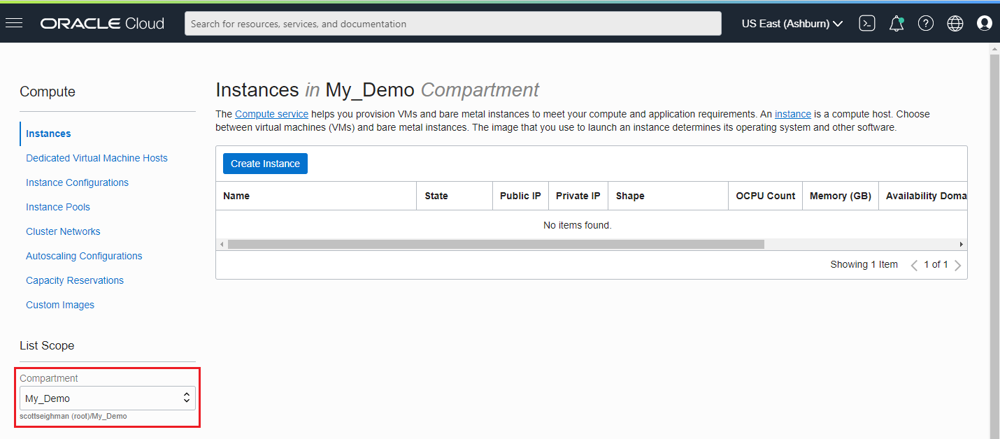

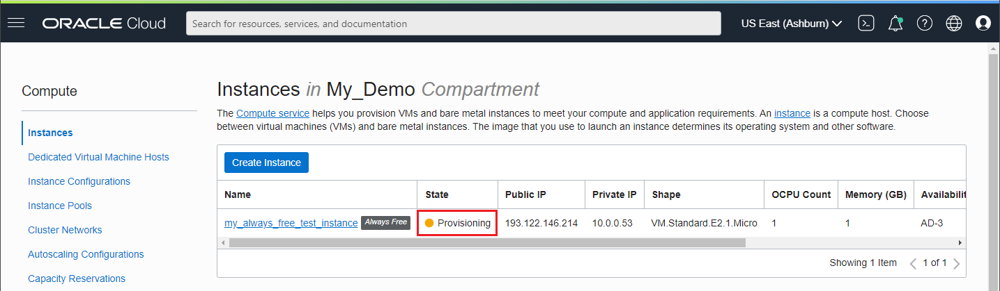

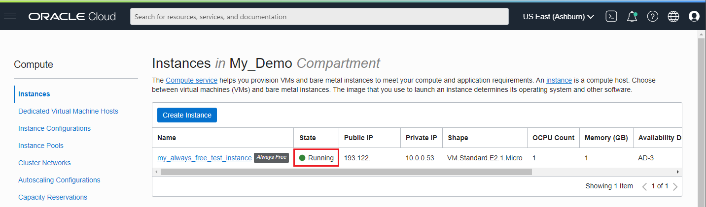


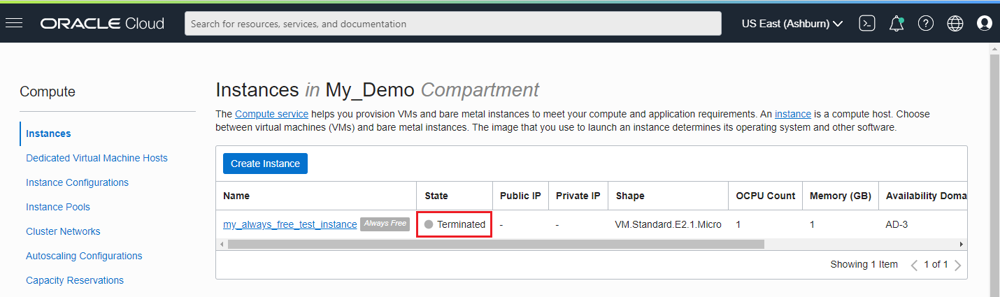


**Note**: You can remove the `teardown-yaml` reference in the `sample.yaml` file if you want to keep the newly provisioned instance, otherwise the instance will be deleted automatically.

#### Creating an A1 Ampere Instance with GraalVM

Edit the `sample.yaml` file
